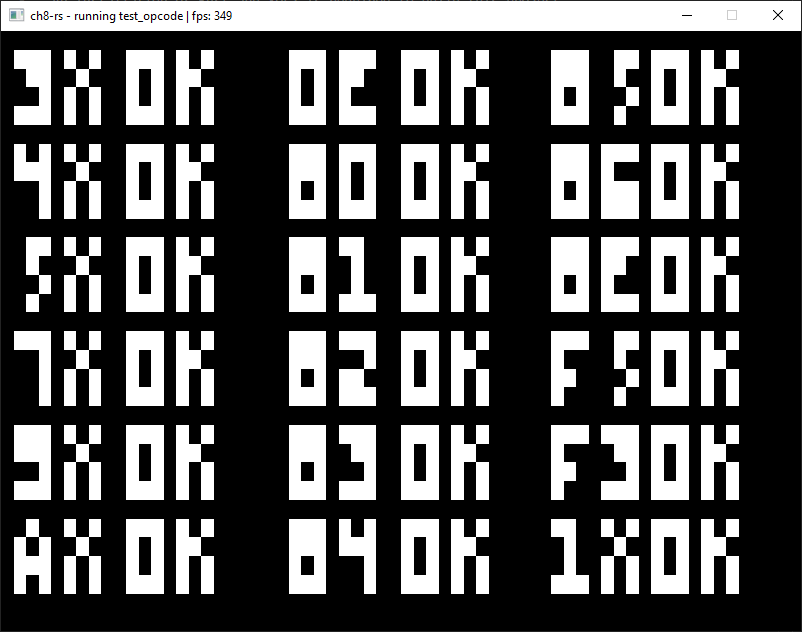

# ch8-rs
A very basic emulator for CHIP-8 architecture made in Rust.



# Playing
A rom can be played by executing the following command:

```bash
./ch8-rs [optional: --debug] <path_to_rom_file>
```

# Building
An installation of Rust and SDL2 is required to build this project. SDL2 must be manually extracted to your Rust directory, a detailed walkthrough for this is available [here](https://github.com/Rust-SDL2/rust-sdl2#sdl20-development-libraries).

Once the above step is completed you can build the application by simply running the following command:
```bash
cargo build [optional: --release]
```
